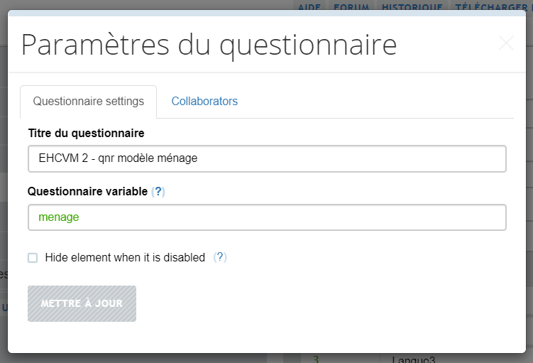
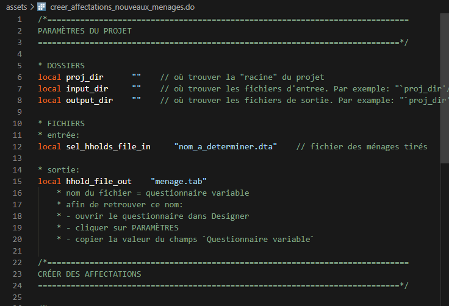
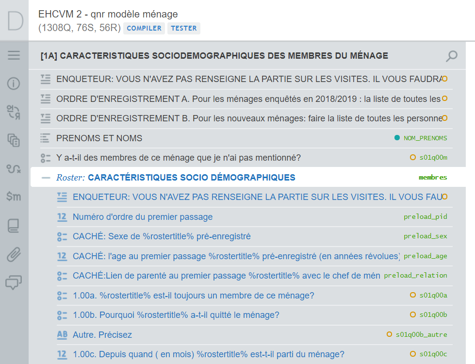
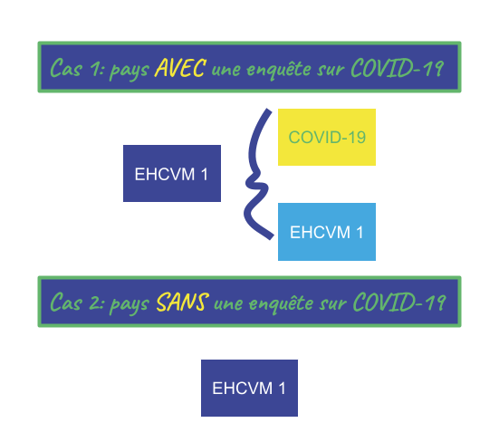
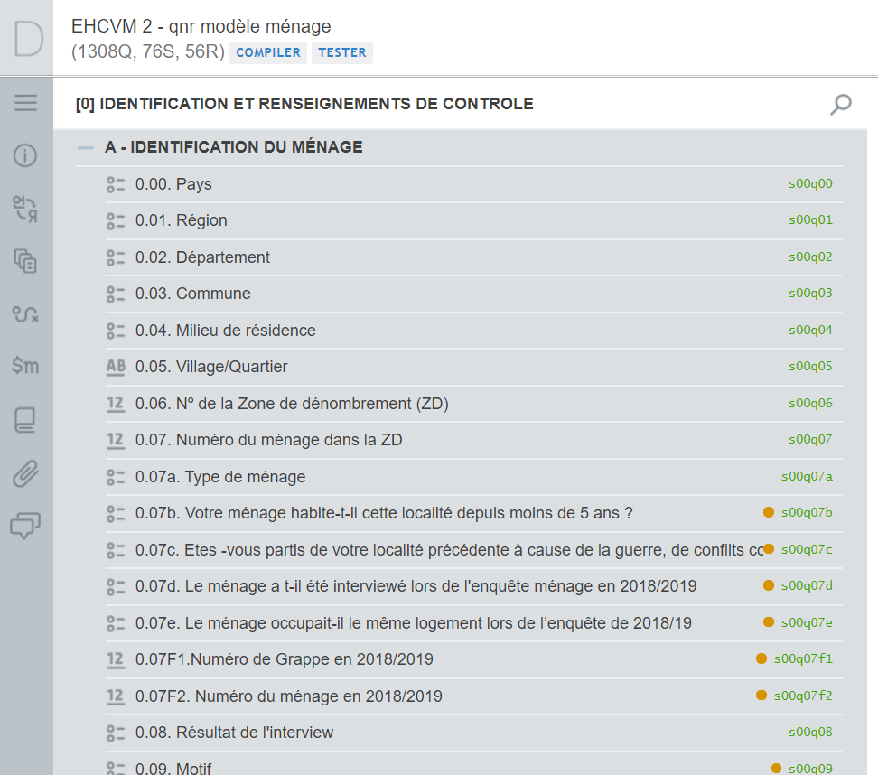
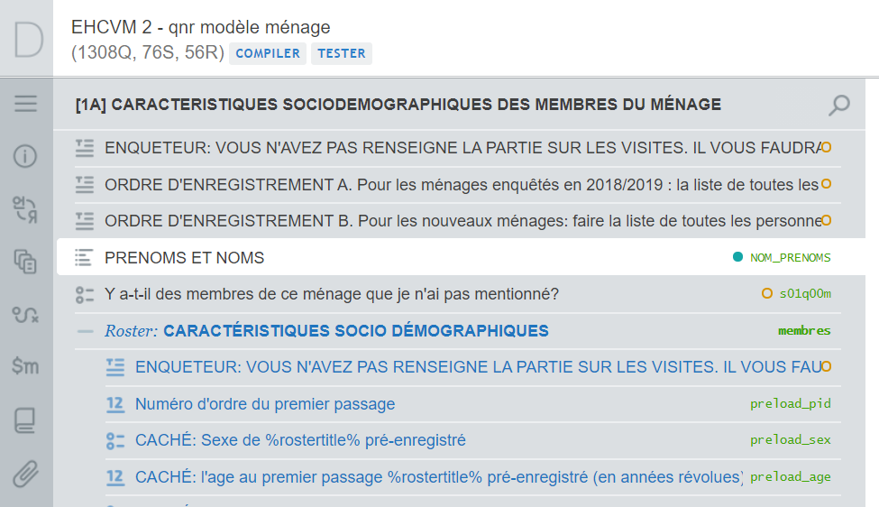
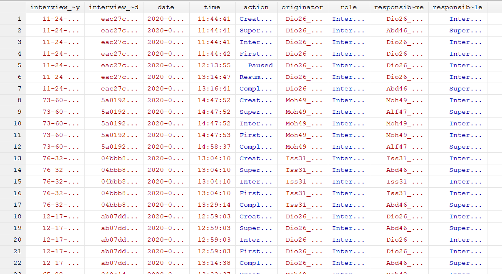
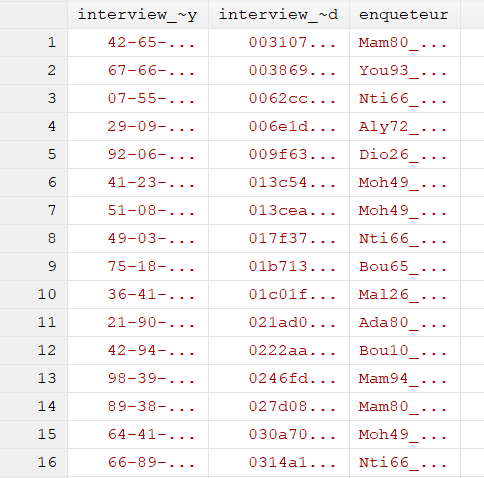
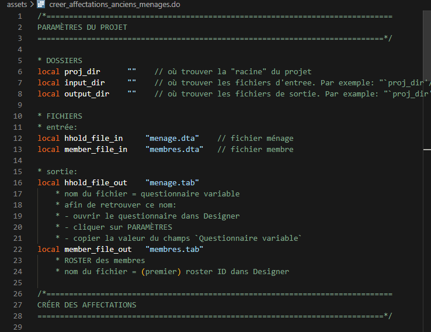

```{r knitr_options, include = FALSE, echo = FALSE, warning = FALSE, message = FALSE}

# knitr options
knitr::opts_chunk$set(
	eval = FALSE,
    echo = TRUE, 
	warning = FALSE,
	message = FALSE,
	out.width = '100%')

```

```{r load_libs, eval=TRUE, echo = FALSE}
library(xaringanExtra)
library(fontawesome)
library(emo)
```

```{r xaringan_extra, eval=TRUE, echo = FALSE}

xaringanExtra::use_panelset()
xaringanExtra::use_tachyons()
# icon_height <- 25
htmltools::tagList(
    xaringanExtra::use_clipboard(
        button_text = "<i class=\"fa fa-clipboard\" style=\"font-size:100p\"></i>",
        # fontawesome::fa(name = "clipboard", height = icon_height),
        success_text = "<i class=\"fa fa-check\" style=\"color: #90BE6D;font-size:25p\"></i>",
        # fontawesome::fa(name = "check", fill = "#90BE6D", height = icon_height),
        error_text = "<i class=\"fa fa-times-circle\" style=\"color: #F94144;font-size:25p\"></i>"
        # fontawesome::fa(name = "times-circle",  fill = "#F94144", height = icon_height)
    ),
    rmarkdown::html_dependency_font_awesome()
)

```

class: section-title-0, middle, center, inverse

# `r rmarkdown::metadata$title`
## `r rmarkdown::metadata$subtitle`

---

class: title, title-0

# Feuille de route

<br>
<br>
.box-0.box-txt[Guide d'emploi]

.box-1.box-txt[Nouveaux ménages]

.box-2.box-txt[Anciens ménages]

---

class: section-title-0, middle, center, inverse

# Guide d'emploi

## (i.e. comment se servir de ces diapos)

---

layout: true

class: title, title-0

---

# Copier-coller du code

.left-column-bg[
<video width="1920" height="500" controls>
  <source src="assets/copy_paste_code.mp4" type="video/mp4">
</video>
]

.right-column-sm[
- Positionner le curseur sur le code
- Cliquer sur l'icône afin de copier
- Copier ailleurs (e.g., Stata, editeur, etc.)
]

---

# Où trouver le programme modèle `r fontawesome::fa(name = "laptop-code")`

- [Nouveaux ménages](#programme_nouveaux_menages)
- [Anciens ménages](#programme_anciens_menages)

---

layout: false

class: section-title-1, center, middle, inverse

# Nouveaux ménages

---

layout: true
class: title, title-1

---

# Recette `r emo::ji("chef")`

1. Fixer les paramètres du projet
1. Retenir les informations nécessaires
1. Créer un nouvel ID de l'entretien
1. Décider de l'affectation
1. Valider votre travail
1. Sauvegarder vers le format tab
1. Zipper le fichier tab
1. Importer le ficher sur SuSo

---

# Outils `r emo::ji("hocho")`

- `local`
- `use`
- `generate` / `replace`
- `rename`
- `keep`
- `tempfile`
- `save`
- `capture`
- `confirm`
- `assert`
- `outsheet`
- `zipfile`

---

# Fixer les paramètres du projet `r fa(name = "cog", fill = "white")`

.panelset[

.panel[.panel-name[Dossiers]

```{stata params_folders}

* DOSSIERS
local proj_dir      ""    // où trouver la "racine" du projet
local input_dir     ""    // où trouver les fichiers d'entree. Par exemple: "`proj_dir'/entree/"
local output_dir    ""    // où trouver les fichiers de sortie. Par example: "`proj_dir'/sortie/"

```

]

.panel[.panel-name[Entrées]

```{stata params_input_files}

* FICHIERS
* entrée:
local sel_hholds_file_in     "nom_a_determiner.dta"    // fichier des ménages tirés

```

]

.panel[.panel-name[Sorties]


.pull-left[

]

.pull-right[

```{stata params_output_files}

* sortie:
local hhold_file_out    "menage.tab"
    * nom du fichier = questionnaire variable
    * afin de retrouver ce nom: 
    * - ouvrir le questionnaire dans Designer
    * - cliquer sur PARAMÈTRES
    * - copier la valeur du champs `Questionnaire variable`

```
]

]


]

???

### Dossier

- `proj_dir`. Mettre le répertoire qui est la racine du projet.
- `input_dir`, `output_dir`. Chemin relatif à `proj_dir`

### Sorties

- Ouvrir le questionnaire dans Designer
- Cliquer sur `PARAMÈTRES`
- Prendre la valeur de `Questionnaire variable`
- Mettre ça dans `hhold_file_out` avec une extension `.tab`

---

# Retenir les informations nécessaires

```{stata keep_id_vars}

* INGÉRER LES DONNÉES CONCERNANT LES NOUVEAUX MÉNAGES
* utiliser la méthode selon le format du fichier d'entrée
* si Stata
use "`input_dir'/`sel_hholds_file_in'", clear
* si Excel
* import excel using "`input_dir'/`sel_hholds_file_in'", ///
*     sheet("nom_de_l_onglet")  /// désigner le nom de l'onglet avec les données
*     firstrow case(preserve)   /// retenir la première ligne comme noms des variables
*     clear

* PRÉPARER LES VARIABLES À PRÉCHARGER
* NB: il est possible qu'il y ait des manipulations à faire pour avoir une base
* de la forme et du contenu souhaité
gen vague = 1

* RETENIR LES VARIABLES À PRÉCHARGER
keep interview__id ///
    grappe id_menage vague nom_prenom_cm localisation_menage    /// couverture
    s00q00 s00q01 s00q02 s00q03 s00q04 s00q05 s00q06 s00q07     /// identification

tempfile menages
save "`menages'"
```

---

# Créer un nouvel ID de l'entretien `r fa(name = "id-card", fill = "white")`

```{stata new_interview_id}
* SuSo demande un ID unique qui s'appelle `interview__id`
* Une approche simple consiste à créer un
* numéro séquentiel pour chaque observation
use "`menages'", clear
capture drop interview__id      // écraser l'identifiant de la base source
gen interview__id = _n          // créer un nouvel identifiant
tempfile households
save "`menages'", replace
```

---

# Décider de l'affectation

Voir les options:

- [Affecter aux superviseurs; puis réaffecter aux agents sur le terrain](#affecter_aux_superviseurs)
- [Affecter aux agents selon la langue parlée](#affecter_langue_parlee)

---

# Valider votre travail `r fa(name = "check-double", fill = "white")`

.panelset[

.panel[.panel-name[Survol]

.pull-left[

### Pourquoi

- **Plus facile à identifier et diagnostiquer les problèmes.** SuSo [avertit sur l'existence de problèmes](https://support.mysurvey.solutions/headquarters/preloading/errors-in-user-supplied-files-for-preloading/). Du code rend l'identification plus vite and la remédiation plus facile.
- **Possible d'identifier des problèmes subtiles.** SuSo n'identifie que les problèmes qui empêche le préchargement. Du code peut rechercher d'autres problèmes.
- **Aide à écrire de meilleur code.** Au minimum, passe les tests. Idéalement, évite activement les problèmes.

]

.pull-right[

### Comment

- **Noms attendus.** SuSo s'attend à retrouver des variables de certains noms. 
- **Types attendus.** SuSo s'attend à ce que les variables soient de certains types.
- **Tout affecté.** SuSo affecte sur la base de la variable `_responsible`, si présente, and affecte le reste à un responsable de défaut. Évite l'affectation par défaut indésirable.

]

]

.panel[.panel-name[Noms attendus]

```{stata new_expected_vars}

* liste (indicative) des variables à vérifier
* action: la liste doit correspondre aux variables attendues dans la base
local expected_vars "interview__id grappe menage_id vague nom_prenom_cm localisation_menage"

foreach expected_var of local expected_vars {

    * vérifier si chaque variable attendue existe dans la base
    * si oui, passer à la suivante
    * sinon, échouer bruyamment
    capture confirm variable `expected_var'
    if (_rc != 0) {
        di "Variable `expected_var' n'a pas été retrouvée."
        error 1
    }

}

```


]

.panel[.panel-name[Types attendus]

```{stata new_expected_type}

local expected_vars "interview__id grappe menage_id vague nom_prenom_cm localisation_menage"
local expected_types "numeric numeric numeric numeric str str"

local num_vars: word count `expected_vars'

forvalues i = 1/`num_vars' {

    local expected_var: word `i' of `expected_vars'
    local expected_type: word `i' of `expected_types'

    * vérifier si chaque variable attendue a le bon type
    * si oui, passer à la suivante
    * sinon, échouer bruyamment
    capture confirm `expected_type' variable `expected_var'
    if (_rc != 0) {
        di "Variable `expected_var' attendue comme `expected_type', mais un autre type a été détecté"
        error 1
    }

}

```

]


.panel[.panel-name[Tout affecté]

```{stata new_all_assigned}

* tous les entretiens ont un responsable désigné
capture assert _responsible != ""
if _rc != 0 {
    qui: count if _responsible == ""
    local num_miss = r(N)
    di "Toute affectation doit être assignée. Mais `num_miss' ne l'ont pas été."
    error 1
}

```

]

]

---

# Sauvegarder vers le format tab `r fa(name ="save", fill = "white")`


```{stata new_save_hhold}

use "`menages'", clear
outsheet using "`output_dir'/`hhold_file_out'", ///
    nolabel /// sauvegarder les valeurs, pas les étiquettes
    noquote /// pas de guillemets pour les variables texte
    replace

```

---

# Zipper le fichier tab `r fa(name = "file-archive", fill = "white")`

```{stata new_zip_all}

* rediriger vers le dossier où mettre le fichier zip
cd "`output_dir'"

* sauvegarder "affectations_nouveaux_menages.zip"
zipfile "`hhold_file_out'", saving("affectations_nouveaux_menages.zip", replace)

```

---

# Importer le ficher sur SuSo `r fa(name = "file-upload", fill = "white")`

<video width="1920" height="500" controls>
  <source src="assets/upload_assignments.mp4" type="video/mp4">
</video>

---

name: programme_nouveaux_menages

# Programme modèle `r fontawesome::fa(name = "laptop-code")`

.left-column-bg[

]

.right-column-sm[

- Obtenir [ici](assets/creer_affectations_nouveaux_menages.do) `r fontawesome::fa(name = "download")`
- Adapter à votre situation

]

---

layout: false

class: section-title-2, center, middle, inverse

# Anciens ménages

---

layout: true
class: title, title-2

---

# Recette `r emo::ji("chef")`

1. Fixer les paramètres du projet
1. Créer un nouvel ID de l'entretien
1. Créer un roster des membres
1. Créer une liste des membres
1. Créer une base niveau ménage
1. Ajouter la liste à la base ménage
1. Créer une liste des variables à protéger
1. Décider de l'affectation
1. Valider votre travail
1. Sauvegarder vers le format délimité par tab
1. Zipper tous les fichiers tab
1. Importer le ficher sur SuSo

---

# Outils `r emo::ji("hocho")`

- `local`
- `use`
- `generate` / `replace`
- `rename`
- `keep`
- `tempfile`
- `merge`
- `save`
- `reshape wide`
- `set obs`
- `collapse`
- `capture`
- `confirm`
- `assert`
- `outsheet`
- `zipfile`

---

# Fixer les paramètres du projet `r fa(name = "cog", fill = "white")`

.panelset[

.panel[.panel-name[Dossiers]

```{stata old_params_folders}

* DOSSIERS
local proj_dir      ""              // où trouver tous les fichiers du projet
local input_dir     "`proj_dir'"    // où trouver les fichiers d'entree. Par exemple: "`proj_dir'/entree/"
local output_dir    "`proj_dir'"    // où trouver les fichiers de sortie. Par example: "`proj_dir'/sortie/"

```

]

.panel[.panel-name[Entrées]

```{stata old_params_input_files}

* FICHIERS
* entrée:
local hhold_file_in     "menage.dta"    // fichier ménage
local member_file_in    "membres.dta"   // fichier membre

* NB: le nom des bases peut être différer d'un contexte à l'autre. Par exemple:
* - pour les données brutes exportés par SuSo, c'est "menage.dta" et "membres.dta", respectivement
* - pour les données apurées et harmonisées, il s'agit des bases s00 et s01, respectivement

```

]

.panel[.panel-name[Sorties]

```{stata old_params_output_files}

* sortie:
local hhold_file_out    "menage.tab"
    * nom du fichier = questionnaire variable
    * afin de retrouver ce nom: 
    * - ouvrir le questionnaire dans Designer
    * - cliquer sur PARAMÈTRES
    * - copier la valeur du champs `Questionnaire variable`
local member_file_out   "membres.tab"
    * ROSTER des membres
    * nom du fichier = (premier) roster ID dans Designer

```

]

.panel[.panel-name[Ménage]

.pull-left[

```{stata old_params_hhold_out}

local hhold_file_out    "menage.tab"
    * nom du fichier = questionnaire variable
    * afin de retrouver ce nom: 
    * - ouvrir le questionnaire dans Designer
    * - cliquer sur PARAMÈTRES
    * - copier la valeur du champs `Questionnaire variable`

```

]

.pull-right[


]

]

.panel[.panel-name[Membres]

.pull-left[

```{stata old_params_memmbers_out}

local member_file_out   "membres.tab"
    * ROSTER des membres
    * nom du fichier = (premier) roster ID dans Designer

```

]

.pull-right[



]

]

]

---

# Créer un nouvel ID de l'entretien `r fa(name = "id-card", fill = "white")`

```{stata interview_id}
* SuSo demande un ID unique qui s'appelle `interview__id`. Créer un numéro séquentiel pour chaque observation
use "`input_dir`/`hhold_file_in'", clear
gen interview__id_new = _n
tempfile menages
save "`menages'", replace

* NB: pour fusionner les bases menage et membres, on a besoin de variables qui :
* - sont disponbiles dans les deux bases et 
* - qui identifient uniquement chaque ménage
* Ces variables peuvent être différente selon la nature des bases d'entrée
* - pour les données brutes exportés par SuSo, c'est interview__id
* - pour les données apurées (e.g., les bases s00 et s01), c'est hhid ou la combinaison de grappe et menage

* ajouter ce nouvel ID à chaque fichier
use "`input_dir`/`member_file_in'", clear
merge m:1 interview__id using "`menages'",  /// fusionner par hhid qui peut être différent selon les bases d'entrée
    keepusing(interview__id_new)            /// ajouter la variable interview__id du fichier ménage
    keep(3) nogen noreport                  /// ne créer pas _merge; n'afficher pas les résultats; retenir les cas en commun

tempfile membres
save "`membres'", replace

```

---

# Créer un roster des membres `r fa(name = "users", fill = "white")`

.panelset[

.panel[.panel-name[Utiliser]

.left-column-bg[
.w-60.center[

]
]

.right-column-sm[
### Général

- Identifier la dernière observation du ménage
- Puiser dans ces infos sur les membres

### COVID-19

- Prendre la dernière observation du panel

]

]

.panel[.panel-name[Enlever]

```{stata members_remove}
use "`membres'", clear

* Garder les personnes toujours membre du ménage (selon la dernière enquête)
* NB: ceci n'est pertinent que pour les enquêtes téléphoniques où l'on
* constate le départ des membres
* NB: le nom de la variable doit être adapté à vos données
keep if toujours_membre == 1

```

]

.panel[.panel-name[Renommer]

.pull-left[


]

.pull-right[

```{stata members_rename}
* renommer/créer des variables pour s'accorder avec SuSo

// ID panel du membre
gen preload_pid = s01q00a

// sexe
gen preload_sex = s01q01

// âge
gen preload_age = AgeAnnee // ou à défaut de cela, s01q04a

// lien de parenté
gen preload_relation = s01q02

```


]

]

.panel[.panel-name[Renuméroter]

```{stata members_renumber}

* trier par identifiant de ménage et de membre
* pas strictement nécessaire; juste plus propre
sort interview__id s01q00a

* NB: si la base contient la variable membres__id déjà, il faut la supprimer

* créer un nouveau numéro séquentiel pour identifier les membres
* pourquoi?
* SuSo a besoin d'un ID membre qui:
* - commence à partir de 0
* - est séquentiel
* - n'a pas de lacunes dans la séquence
* Ceci garanti que la liste des membres (diapo suivant) est de la bonne forme
* L'ID membre peut ne pas être séquentiel pour plusieurs raisons :
* - Membres éliminés (voir plus tôt ce diapo)
* - Lacunes existent à cause du processus de capter les infos (e.g., membre ajouté puis supprimé par l'enquêteur)
bysort interview__id: generate membres__id = _n

```

]

.panel[.panel-name[Retenir]

.pull-left[


]

.pull-right[

```{stata members_keep}

keep interview__id_new interview__id members__id /// IDs
    preload_pid         /// identifiant panel du membre
    preload_sex         /// sexe
    preload_age         /// âge
    preload_relation    /// lien de parenté
    NOM_PRENOMS         /// nom
    s01q01              /// sexe
    s01q02              /// lien de parenté
    s01q03a             /// DDN: jour
    s01q03b             /// DDN: mois
    s01q03c             /// DDN: année

```
]

]

.panel[.panel-name[Sauvegarder]

```{stata members_save_for}

* préparer pour la création d'une liste
* rien à modifier
tempfile membres_pour_liste
save "`membres_pour_liste'"

* préparer pour le préchargement du roster
* retenir le nouvel identifiant ménage
drop interview__id
rename interview__id_new interview__id
tempfile membres_roster
save "`membres_roster'"

```

]

]

---

# Créer une liste des membres `r fa(name = "users", fill = "white")`

```{stata members_list}
use "`membres_pour_liste'", clear

keep interview__id_new membres__id NOM_PRENOMS

* La liste de SuSo est indexée à 0
* membres__id commence avec 1
* soustraire 1 de membres__id pour que les deux s'accordent
replace membres__id = membres__id - 1

* Les questions liste de SuSo's sont formattées comme suit :
* - chaque élément de la liste occupe sa propre colonne
* - le nom de chaque élément consiste de: du nom de variable chez Designer, 
*    le texte __ comme séparateur, et de l'indice de l'élément (e.g. var__0 pour le 1ier élément, var__2 pour le 2e, etc)
* Afin de ramener la base dans le format demandé par SuSo:
* renommer la variable pour être du format var__
rename NOM_PRENOMS NOM_PRENOMS__

* remodeler les données de sorte que chaque élément soit une colonne et chaque 
* colonne ait un nom de la forme var__0, var__1, etc.
reshape wide NOM_PRENOMS__, i(interview__id_new) j(membres__id)

tempfile membres_liste
save "`membres_liste'"

```

---

# Créer une base niveau ménage `r fa(name = "home", fill = "white")`

.pull-left[



]

.pull-right[

```{stata household_data}

use "`menages'", clear

* créer des variables pour les besoin d'identification
gen vague = 1               // vague de collecte
gen s00q07f1 = grappe       // ancien numéro de grappe
gen s00q07f2 = id_menage    // ancien numéro de ménage
gen s00q07a = 1             // tout ancien ménage est résident

* retenir seulement les variables anticipées par SuSo
* comme SuSo ne sait pas comment
* gérer des variables supplémentaires
keep interview__id interview__id_new ///
    grappe id_menage vague nom_prenom_cm localisation_menage /// couverture
    s00q00 s00q01 s00q02 s00q03 s00q04 s00q05 s00q06 s00q07 s00q07a s00q07f* /// identification
    s00q28 /// langue de l'entretien: à retenir seulement si l'affectation se fait sur cette base

tempfile menages
save "`menages'", replace

```

]

---

#  Ajouter la liste à la base ménage `r fa(name = "home", fill = "white")`

.pull-left[



]

.pull-right[

```{stata add_lists}

use "`menages'", clear

* ajouter la question liste à la base ménage
merge 1:1 interview__id_new using "`membres_liste'", nogen noreport assert(3) keep(3)

tempfile menages_plus_liste
save "`menages_plus_liste'"

```

]

---

# Créer une liste des variables à protéger `r fa(name = "lock", fill = "white")`

.pull-left[


]

.pull-right[

```{stata r1_protected_vars}

* créer une base de la forme suivante :
* | variable__name  |
* | --------------- |
* | "var1"          |
* | "var2"          |

* créer une base vide avec 1 observation
clear
set obs 1

* peupler l'observation avec le nom de la
* variable dont les valeurs préchargées sont à protéger
* typiquement, il s'agit de questions qui enclenchent un roster
* comme la liste ici-bas
gen variable__name = ""
replace variable__name = "NOM_PRENOMS" in 1

tempfile protected_vars
save "`protected_vars'"

```

]

---

# Décider de l'affectation

### Options

- [Sur le champs](#affecter_aux_superviseurs)
- Avant la descente sur le terrain, sur la base de:
    - [Ancien agent](#ancien_agent)
    - [Agent qui parle la langue](#affecter_langue_parlee)

---

name: affecter_aux_superviseurs

# Décider de l'affectation &mdash; sur le champs

- Affecter aux chefs d'équipe
- Réaffecter vers les agents sur le terrain

---

name: ancien_agent

# Décider de l'affectation &mdash; ancien agent

.panelset[

.panel[.panel-name[Base]

.left-column-bg[

]

.right-column-sm[
- Chaque action sur les entretiens.
- Qui a réalisé l'action et quand.
- Voir [ici](https://docs.mysurvey.solutions/headquarters/export/system-generated-export-file-anatomy/) pour plus de détails techniques.
]

]

.panel[.panel-name[Extraire]


.pull-left[

]

.pull-right[
```{stata identify_responsible}
* retenir les actions par les enquêteurs
use interview__actions.dta, clear
keep if (responsible__role == 1)

* prendre comme responsable le dernier enquêteur à toucher le questionnaire
collapse (last) enqueteur = responsible__name, by(interview__id)
tempfile enqueteurs_responsibles
save "`enqueteurs_responsibles'"

* fusionner ces infos à la base ménage
use "`households_plus_lists'", clear
merge 1:1 interview__id using "`enqueteurs_responsibles'", keep(3) nogen keepusing(enqueteur)
rename enqueteur _responsible

* retenir le nouvel identifiant comme identifiant; sauvegarder le résultat
drop interview__id
rename interview__id_new interview__id
tempfile menages_final
save "`menages_final'", replace

```
]

]

]

---

name: affecter_langue_parlee

# Décider de l'affectation &mdash; par langue parlée

.panelset[

.panel[.panel-name[Connaître]

.pull-left[

Imaginons qu'il y a 3 enquêteurs:

- Interviewer_1
- Interviewer_2
- Interviewer_3

]

.pull-right[

- **Interviewer_1 parle:**
    - Bambara/Malinké (1)
    - Peulh/Foulfoulbé (2)
    - Sonhrai (3)
    - Sarakolé (4)
- **Interviewer_2 parle:**
    - Kassonké (5)
    - Sénoufo/Minianka (6)
    - Dogon (7)
    - Maure (8)
- **Interviewer_3 parle:**
    - Tamacheq (9)
    - Bobo / Dafing / Samogo (10)
    - Français (11)

]

]

.panel[.panel-name[Appareiller]

```{stata assign_to_ints}

use "`households_plus_lists'", clear

* SuSo affecte selon le nom d'utilisateur retrouvé dans la 
* colonne _responsible
* Créer des affectations en mettant ensemble les enquêteurs et le ménages
* selon les langues parlées par l'enquêteur
* Ici-bas se trouve un exemple simple. L'affectation réale peut être plus complexe.
gen _responsible = ""
replace _responsible = "Interviewer_1" if inlist(s00q28, 1, 2, 3, 4)
replace _responsible = "Interviewer_2" if inlist(s00q28, 5, 6, 7, 8)
replace _responsible = "Interviewer_2" if inlist(s00q28, 9, 10, 11)

```

]

.panel[.panel-name[Ajuster]


```{stata r1_assign_adjust}

* voir combien d'entretiens sont affectés à chaque enquêtuer
tab _responsible

* faire des justements, besoin
* soit de manière ad-hoc ou par une règle 
* replace _responsible ...

* retenir le nouvel identifiant comme identifiant
* sauvegarder le résultat
drop interview__id
rename interview__id_new interview__id
tempfile menages_final
save "`menages_final'", replace


```

]

]

---


# Valider votre travail `r fa(name = "check-double", fill = "white")`

.panelset[

.panel[.panel-name[Survol]

.pull-left[

### Pourquoi

- **Plus facile à identifier et diagnostiquer les problèmes.** SuSo [avertit sur l'existence de problèmes](https://support.mysurvey.solutions/headquarters/preloading/errors-in-user-supplied-files-for-preloading/). Du code rend l'identification plus vite and la remédiation plus facile.
- **Possible d'identifier des problèmes subtiles.** SuSo n'identifie que les problèmes qui empêche le préchargement. Du code peut rechercher d'autres problèmes.
- **Aide à écrire de meilleur code.** Au minimum, passe les tests. Idéalement, évite activement les problèmes.

]

.pull-right[

### Comment

- **Noms attendus.** SuSo s'attend à retrouver des variables de certains noms. 
- **Types attendus.** SuSo s'attend à ce que les variables soient de certains types.
- **Tout affecté.** SuSo affecte sur la base de la variable `_responsible`, si présente, and affecte le reste à un responsable de défaut. Évite l'affectation par défaut indésirable.
- **Liste complète.** Les éléments d'une variable liste doivent être non-vides--en particulier, le premier.

]

]

.panel[.panel-name[Noms attendus]

```{stata r1_expected_vars}

* liste (indicative) des variables à vérifier
* action: la liste doit correspondre aux variables attendues dans la base
local expected_vars "interview__id grappe menage_id vague nom_prenom_cm localisation_menage NOM_PRENOMS__0"

foreach expected_var of local expected_vars {

    * vérifier si chaque variable attendue existe dans la base
    * si oui, passer à la suivante
    * sinon, échouer bruyamment
    capture confirm variable `expected_var'
    if (_rc != 0) {
        di "Variable `expected_var' n'a pas été retrouvée."
        error 1
    }

}

```


]

.panel[.panel-name[Types attendus]

```{stata r1_expected_type}

local expected_vars "interview__id grappe menage_id vague nom_prenom_cm localisation_menage NOM_PRENOMS__0"
local expected_types "numeric numeric numeric numeric str str str"

local num_vars: word count `expected_vars'

forvalues i = 1/`num_vars' {

    local expected_var: word `i' of `expected_vars'
    local expected_type: word `i' of `expected_types'

    * vérifier si chaque variable attendue a le bon type
    * si oui, passer à la suivante
    * sinon, échouer bruyamment
    capture confirm `expected_type' variable `expected_var'
    if (_rc != 0) {
        di "Variable `expected_var' attendue comme `expected_type', mais un autre type a été détecté"
        error 1
    }

}

```

]


.panel[.panel-name[Tout affecté]

```{stata r1_all_assigned}

* tous les entretiens ont un responsable désigné
capture assert _responsible != ""
if _rc != 0 {
    qui: count if _responsible == ""
    local num_miss = r(N)
    di "Toute affectation doit être assignée. Mais `num_miss' ne l'ont pas été."
    error 1
}

```

]

.panel[.panel-name[Liste compète]

```{stata r1_lists_complete}

* la liste des membres n'est pas vide
capture assert !inlist(NOM_PRENOMS__0, "", " ")
if _rc != 0 {
    qui: count if inlist(NOM_PRENOMS__0, "", " ")
    local num_miss = r(N)
    di "Les listes ne devraient pas avoir des éléments vides. Mais `num_miss' instances de NOM_PRENOMS__0 ont une valeur nulle/vide."
}

```

]

]

---

# Sauvegarder vers le format tab `r fa(name ="save", fill = "white")`

.panelset[

.panel[.panel-name[Ménages]

.pull-left[

```{stata r1_save_hhold}

* NIVEAU MÉNAGE
* nom du fichier = questionnaire variable
* afin de retrouver ce nom: 
* - ouvrir le questionnaire dans Designer
* - cliquer sur PARAMÈTRES
* - copier la valeur depuis Questionnaire variable
use "`menages_final'", clear
outsheet using "`output_dir'/`hhold_file_out'", ///
    nolabel /// sauvegarder les valeurs, pas les étiquettes
    noquote /// pas de guillemets pour les variables texte
    replace

```

]

.pull-right[


]

]

.panel[.panel-name[Membres]

.pull-left[

```{stata r1_save_members}

* NIVEAU MEMBRES
* nom du fichier = (premier) roster ID pour ce roster dans Designer
use "`membres_roster'", clear
outsheet using "`output_dir'/`member_file_out'", ///
    nolabel /// sauvegarder les valeurs, pas les étiquettes
    noquote /// pas de guillemets pour les variables texte
    replace

```
]

.pull-right[


]

]

.panel[.panel-name[Variables protégées]

```{stata r1_save_protected}

* VARIABLE DONT LES VALEURS PRÉCHARGÉES SONT À PROTÉGER
* nom du fichier = nom imuable attendu par le système: protected__variables
use "`protected_vars'", clear
outsheet using "`output_dir'/protected__variables.tab", noquote replace

```

]

]

---

# Zipper tous les fichiers tab `r fa(name = "file-archive", fill = "white")`

```{stata old_zip_all}

* rediriger vers le dossier où mettre le fichier zip
cd "`output_dir'"

* lister tous les fichiers se terminant en ".tab"
* créer un fichier zip pour les regrouper
* sauvegarder "affectations.zip"
zipfile "*.tab", saving("affectations_anciens_menages", replace)

```

---

# Importer le ficher sur SuSo `r fa(name = "file-upload", fill = "white")`

<video width="1920" height="500" controls>
  <source src="assets/upload_assignments.mp4" type="video/mp4">
</video>

---

name: programme_anciens_menages

# Programme modèle `r fontawesome::fa(name = "laptop-code")`

.left-column-bg[

]

.right-column-sm[


- Cliquer [ici](assets/creer_affectations_anciens_menages.do) `r fontawesome::fa(name = "download")`
- Adapter à votre situation

]